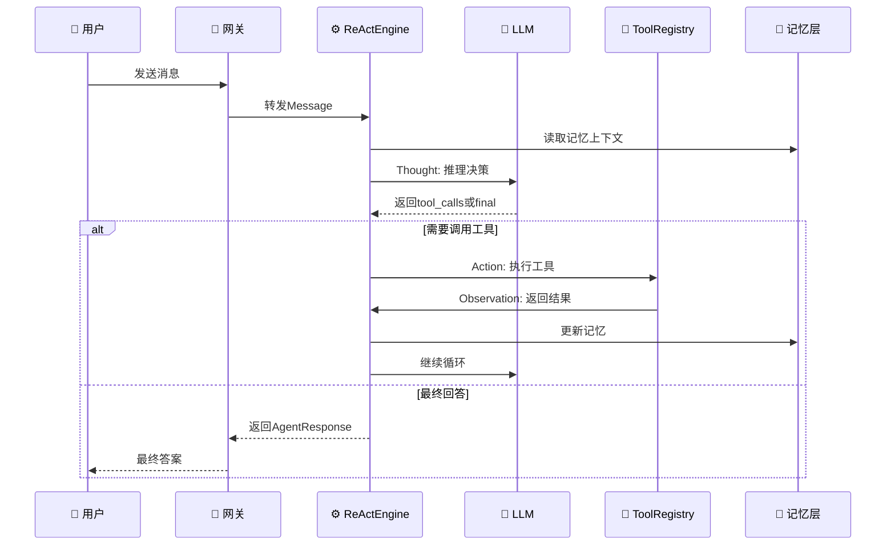
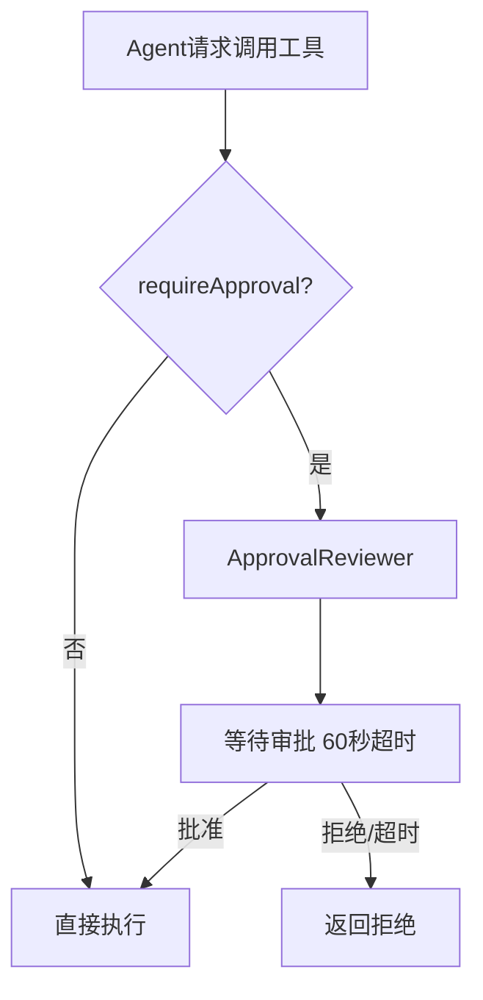

<div align="center">

# ⚡ 凤凰 · Phoenix

**企业级 AI Agent 框架** — ReAct 循环 · 四层记忆 · 安全沙箱 · Spring Boot 原生集成


---

## 📖 目录

- [一、架构总览](#一架构总览)
- [二、项目结构](#二项目结构)
- [三、快速启动](#三快速启动)
- [四、API 手册](#四-api-手册)
- [五、配置参考](#五配置参考)
- [六、如何扩展](#六如何扩展)
- [七、记忆系统](#七记忆系统)
- [八、安全机制](#八安全机制)
- [九、部署指南](#九部署指南)
- [十、性能与监控](#十性能与监控)

---

## 一、架构总览

### 核心理念

```
┌─────────────────────────────────────────────────┐
│                   用户接口层                       │
│  ┌─────────────┐  ┌──────────────┐              │
│  │  WebSocket   │  │  REST API    │  ← HTTP/WS  │
│  └──────┬──────┘  └──────┬───────┘              │
├─────────┼────────────────┼───────────────────────┤
│         └──────┬─────────┘                       │
│                ▼                                  │
│  ┌──────────────────────────┐                    │
│  │   ProtocolNormalizer     │  ← 协议净化/鉴权    │
│  └──────────┬───────────────┘                    │
│             ▼                                     │
│  ┌──────────────────────────┐   Spring Boot      │
│  │      ReActEngine         │  ← Thought/Action   │
│  │   Thought → Action →     │    /Observation     │
│  │        Observation       │                     │
│  └──┬───────┬───────┬───────┘                    │
│     │       │       │                             │
│     ▼       ▼       ▼                             │
│  ┌────┐ ┌────┐ ┌────────┐                       │
│  │ LLM│ │Tool│ │ Memory │                       │
│  │ API│ │Reg │ │  Layer │                       │
│  └────┘ └────┘ └────────┘                       │
└─────────────────────────────────────────────────┘
```

### ReAct 循环流程



---

## 二、项目结构

```
phoenix/
├── pom.xml                                 # 父POM
│
├── your-agent-core/                        # ⭐ 核心模块（零Spring依赖）
│   ├── model/                              # 协议层
│   │   ├── Message.java                    # 统一消息体
│   │   ├── ToolCall.java                   # 工具调用请求
│   │   └── AgentResponse.java              # 最终响应
│   ├── loop/                               # ReAct执行循环
│   │   └── ReActEngine.java                # Thought→Action→Observation
│   ├── llm/                                # LLM抽象
│   │   ├── ModelProvider.java              # 接口
│   │   └── OpenAiModelProvider.java        # OpenAI实现
│   ├── memory/                             # 四层记忆
│   │   ├── MemoryLayer.java                # 接口
│   │   ├── CoreMemory.java                 # L1 核心
│   │   ├── UserProfile.java                # L2 画像
│   │   ├── SkillMemory.java                # L3 技能库
│   │   └── LongTermStore.java              # L4 SQLite+FTS5
│   └── tool/                               # 工具抽象
│       ├── Tool.java                       # @Tool注解
│       ├── ToolExecutor.java               # 执行器
│       └── ToolRegistry.java               # 注册中心
│
├── your-agent-spring-boot-starter/         # ⭐ Spring Boot集成
│   ├── config/
│   │   ├── AgentAutoConfiguration.java     # 自动装配
│   │   └── AgentProperties.java            # 配置映射
│   ├── gateway/
│   │   ├── WebSocketGateway.java           # WS长连接
│   │   ├── RestGateway.java                # HTTP入口
│   │   └── WebSocketConfig.java            # WS注册
│   ├── sandbox/
│   │   ├── SandboxStrategy.java            # 沙箱策略
│   │   └── ApprovalReviewer.java           # 人工审批
│   └── tools/
│       ├── SpringToolRegistry.java         # @Tool扫描
│       └── TerminalTool.java               # 终端命令
│
├── your-business-app/                      # 🧩 你的业务模块
│   ├── AgentApplication.java               # 启动入口
│   ├── agent/BusinessToolWrapper.java      # @Service→@Tool适配
│   └── service/ReportService.java          # 示例服务
│
├── your-agent-skill-repo/                  # 📚 技能库
│   └── skills/{generate_report,analyze_log}.md
│
├── your-evolution-core/                 # 🧬 自进化模块（新增）
│   ├── core/                             # 元进化循环引擎
│   │   ├── EvolutionEngine.java          # 扫描→LLM补丁→编译→测试→回滚
│   │   ├── introspection/                # 代码分析器 + 坏味道检测
│   │   ├── mutation/                     # 补丁生成 + 应用 + 回滚
│   │   ├── validation/                   # 编译验证 + 测试 + 质量门禁
│   │   ├── safety/                       # 安全策略（7保护文件+6禁止模式）
│   │   └── journal/                      # 演化日志（Markdown格式）
│   └── spring/                           # Spring Boot自动配置 + REST端点
│
├── your-integration-tests/                 # 🧪 集成测试
│
└── deploy/                                 # 🚀 部署
    ├── Dockerfile
    ├── docker-compose.yml
    └── deploy.sh
```

---

## 三、快速启动

### 环境要求

| 依赖 | 版本 | 说明 |
|:---|:---:|:---|
| JDK | 21+ | 必需 |
| Maven | 3.9+ | 可选 |
| Docker | 24+ | 仅部署需要 |
| API Key | — | OpenAI或本地Ollama |

### 30秒启动（开发模式）

```bash
# 1. 编译
mvn clean install -DskipTests

# 2. 配置密钥
export OPENAI_API_KEY=sk-your-key-here

# 3. 启动
mvn spring-boot:run -pl your-business-app
```

### 使用本地 Ollama（免费）

```bash
ollama pull qwen2:7b
mvn spring-boot:run -pl your-business-app -Dspring-boot.run.profiles=dev
```

---

## 四、API 手册

### REST API（HTTP同步）

**Base URL:** `http://localhost:8080/api/agent`

#### `POST /api/agent/chat` — 发送消息

```bash
curl -X POST http://localhost:8080/api/agent/chat \
  -H "Content-Type: application/json" \
  -d '{"content": "帮我生成上个月的销售报告"}'
```

**响应：**
```json
{
  "content": "===== 销售报告 (2026-06-01 ~ 2026-06-30) =====\n总销售额: ¥1,234,567.89",
  "iterations": 2,
  "durationMs": 3456,
  "truncated": false
}
```

#### `POST /api/agent/reset` — 重置对话
```bash
curl -X POST http://localhost:8080/api/agent/reset
```

#### `GET /api/agent/health` — 健康检查
```bash
curl http://localhost:8080/api/agent/health
```

### WebSocket API（长连接）

**端点:** `ws://localhost:8080/ws/agent`

```javascript
const ws = new WebSocket('ws://localhost:8080/ws/agent');
ws.onopen = () => ws.send(JSON.stringify({type:'chat', content:'查日志'}));
ws.onmessage = e => console.log(JSON.parse(e.data).content);
```

**消息协议：**

| 方向 | type | content | 说明 |
|:---|:---|:---|:---|
| C→S | `chat` | 用户输入 | 发送对话 |
| C→S | `reset` | — | 重置上下文 |
| S→C | `connected` | 提示信息 | 连接确认 |
| S→C | `message` | 最终答案 | 含中间步骤 |
| S→C | `error` | 错误描述 | 异常反馈 |

---

## 五、配置参考

```yaml
your:
  agent:
    llm:
      provider: openai          # openai | ollama | azure
      base-url: https://api.openai.com/v1
      api-key: ${OPENAI_API_KEY}
      model-name: gpt-4o
      max-tokens: 4096
      temperature: 0.7
      timeout-seconds: 60
    react:
      max-iterations: 10        # 防止无限循环
    sandbox:
      type: none                # none | docker
      docker-image: ubuntu:22.04
    websocket:
      endpoint: /ws/agent
```

---

## 六、如何扩展

### 添加一个新工具（2分钟）

```java
@Component
public class OrderTool {
    @Tool(
        name = "query_order",
        description = "根据订单号查询订单详情",
        parametersSchema = "{\"type\":\"object\",\"properties\":{" +
            "\"orderId\":{\"type\":\"string\"}},\"required\":[\"orderId\"]}"
    )
    public String queryOrder(String argsJson) {
        return "订单 #ORDER123 状态: 已发货";
    }
}
```

### 切换模型供应商

```java
@Component
public class AnthropicProvider implements ModelProvider {
    public Message chat(List<Message> msgs, List<String> tools) {
        // 调用 Anthropic Claude API...
    }
    public String modelName() { return "claude-3-opus"; }
}
```

---

## 七、记忆系统

四层记忆架构（借鉴 Hermes/MemGPT）：

| 层级 | 名称 | 存储 | 检索 |
|:---:|:---|:---|:---:|
| L1 | CoreMemory | 内存 | 常驻上下文 |
| L2 | UserProfile | HashMap | 键值匹配 |
| L3 | SkillMemory | ConcurrentHashMap | 模糊匹配 |
| L4 | LongTermStore | SQLite+FTS5 🔥 | 全文检索引擎 |

L4 特性：FTS5虚拟表、自动触发器同步、前缀匹配、分类分页。

---

## 八、安全机制



| 沙箱策略 | 环境 | 说明 |
|:---|:---:|:---|
| `none` | 开发 | 无隔离 |
| `docker` | 生产 | 容器隔离 |

---

## 九、部署指南

```bash
# Docker部署
./deploy/deploy.sh

# 或手动
docker compose -f deploy/docker-compose.yml up -d
```

**生产 Checklist：**
- [ ] `SPRING_PROFILES_ACTIVE=prod`
- [ ] Docker沙箱启用
- [ ] HTTPS（Nginx反向代理）
- [ ] API密钥环境变量

---

## 十、技术栈

| 分类 | 选型 | 版本 |
|:---|:---|:---:|
| 语言 | Java | 21 |
| 框架 | Spring Boot | 3.3.0 |
| 构建 | Maven | 3.9+ |
| LLM | OpenAI 兼容 API | — |
| 记忆 | SQLite + FTS5 | 3.46.0 |
| HTTP | OkHttp | 4.12.0 |
| JSON | Jackson | 2.17.1 |
| 测试 | JUnit 5 + Mockito | 5.10.2 |

---

<div align="center">

**凤凰 · 让 AI Agent 在企业级生产中持续运转**

<sub>Built with ❤️ · 基于 ReAct + Hermes + MemGPT 等前沿研究</sub>

</div>